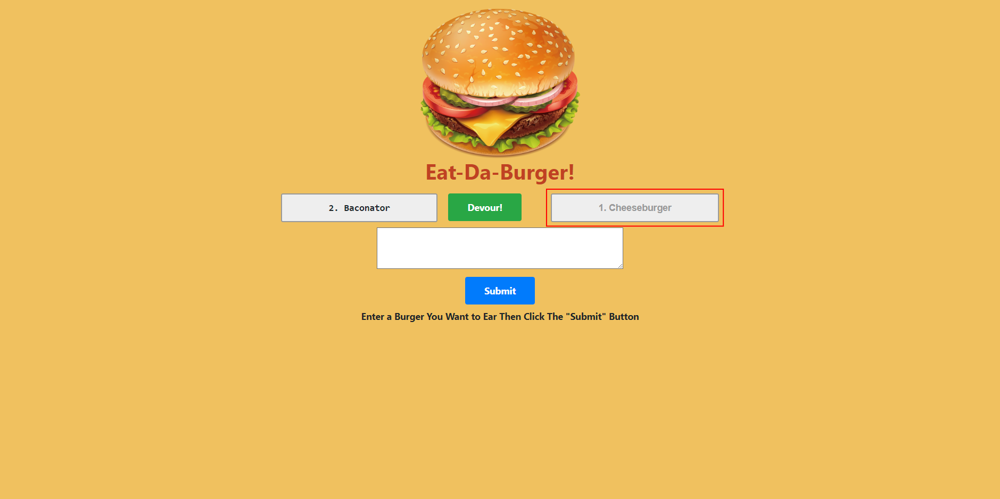

# **Note Taker**

## **Description**
***Eat-Da-Burger*** is a **Node**, **Express**, **MySQL**, **JawsDB**, **Heroku**, and **Custom ORM** application intented for users that want to keep track of burgers they would like to devour, and burgers that they have successfully devour. It is easy to forget or be unable to recall when you want to try a new burger. Being able to take persistent notes of Burgers to devour allows users to have this written information available when needed.

## **Table of Contents**
* [Description](##Description)
* [Installation](##Installation)
* [Usage](##Usage)
* [License](##License)
* [Contributing](##Contributing)
* [Questions](##Questions)

## **Installation**
There is no installation process for ***Eat-Da-Burger***, the app can be found on it's deployed Website at [Eat-Da-Burger.](https://scastanedamunoz-eat-da-burger.herokuapp.com). However, all the app code is available in the [Git Hub Repository](https://github.com/SCastanedaMunoz/Burger). If you decide to clone the Repository, you will have to open the project on your terminal and run the npm i or npm install process. This will fetch and install any required npm packages in order to run the application. ***Eat-Da-Burger*** was built using Node 12.8.2 and npm 6.14.5. 

## **Usage**
As mentioned before, The main purpose of this application is for users to keep track of burgers they would like to devour, and burgers that they have successfully devour. Here are some screenshots of the different areas of the app and how they can be used:

### **Home Page**
First thing user's see when they open the app.

### **Input**
After adding some burger information, users can click on the submit button to add the burger to the list of burgers to devour.

### **User Input**
Burgers will be added to the non-devoured column, when the user has eaten such burger they can mark it as devoured and it will be moved to the devoured colum.

### **Devoured Burgers**
This is where devoured burgers will be listed.

## **License**

This project is under the MIT License:

    Copyright (c) 2020 Santiago Castaneda Munoz

    Permission is hereby granted, free of charge, to any person obtaining a copy
    of this software and associated documentation files (the "Software"), to deal
    in the Software without restriction, including without limitation the rights
    to use, copy, modify, merge, publish, distribute, sublicense, and/or sell
    copies of the Software, and to permit persons to whom the Software is
    furnished to do so, subject to the following conditions:

    The above copyright notice and this permission notice shall be included in all
    copies or substantial portions of the Software.

    THE SOFTWARE IS PROVIDED "AS IS", WITHOUT WARRANTY OF ANY KIND, EXPRESS OR
    IMPLIED, INCLUDING BUT NOT LIMITED TO THE WARRANTIES OF MERCHANTABILITY,
    FITNESS FOR A PARTICULAR PURPOSE AND NONINFRINGEMENT. IN NO EVENT SHALL THE
    AUTHORS OR COPYRIGHT HOLDERS BE LIABLE FOR ANY CLAIM, DAMAGES OR OTHER
    LIABILITY, WHETHER IN AN ACTION OF CONTRACT, TORT OR OTHERWISE, ARISING FROM,
    OUT OF OR IN CONNECTION WITH THE SOFTWARE OR THE USE OR OTHER DEALINGS IN THE
    SOFTWARE.

## **Contributing**
If you wish to contribute to the project, make sure to read the following guidelines:

* Any found bugs should be reported to the repository Issues Tab.
* If you wish your changes to be merged into the app, make sure to create well written, documented and testable code. ***Include Unit Tests***
* If you wish to add a new feature, make sure to include *user stories* as how your feature will help the app. 
* Create a pull request, after proper review it will be merged into the Git Repository

## **Questions**
If you have any questions regarding this app, feel free to contact me through my email, or the [Eat-Da-Burger Repository](https://github.com/SCastanedaMunoz/Burger). All questions will be answered in a reasonable amount of time.

### ***GitHub Profile***
https://github.com/SCastanedaMunoz

### ***Email Contact***
[santiagocm98@hotmail.com](mailto:santiagocm98@hotmail.com)