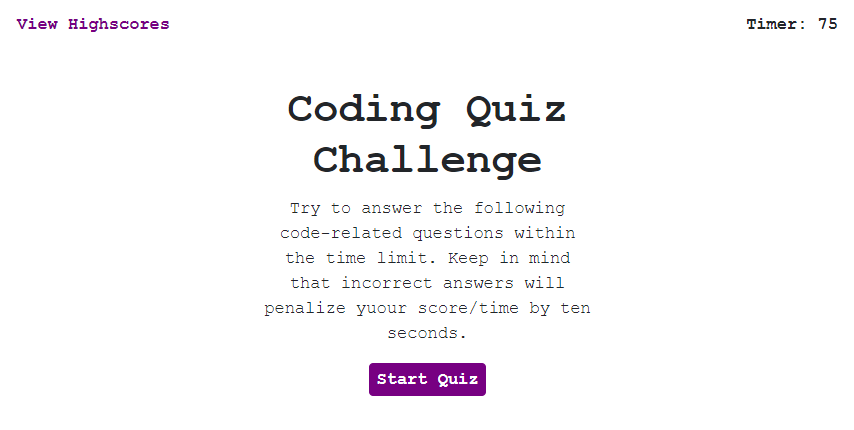
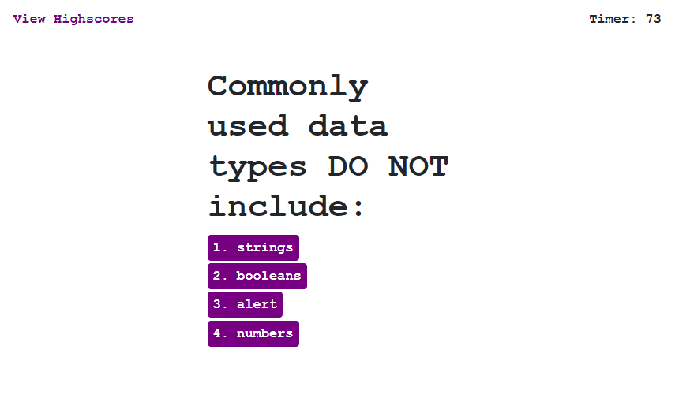
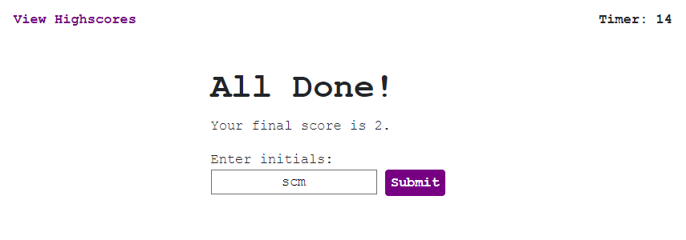
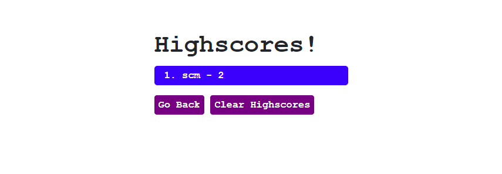

# Code-Quiz

For this Code Quiz Game I decided to use as little hard coded html elements as possible and start only by having an empty bootstrap container where I would be able to add anything I desired. My goal was to create the whole application in just 1 html file while using JQuery as much as possible to take full advantage of its capabilities. For this I brokew down in different states, Initial, Questioning, Submitting Score, and Leaderboard, which represent every single section the user can encounter in the app. Each state has its own function to reset the page to an empty state and create the corresponding elements for such app state. This also allowed me to have proper tracking when knowing which was the last user state in the app and have a proper app cycle. 

[Link to deployed application](https://scastanedamunoz.github.io/Code-Quiz/)

Initial State:



Questioning State:



Submission State:



Leaderboard State:



# Assignment Details

## Web APIs: Code Quiz

As you proceed in your career as a web developer, you will probably be asked to complete a coding assessment, which is typically a combination of multiple-choice questions and interactive challenges. Build a timed code quiz with multiple-choice questions. This app will run in the browser and feature dynamically updated HTML and CSS powered by your JavaScript code. It will also feature a clean and polished user interface and be responsive, ensuring that it adapts to multiple screen sizes.

## User Story

```
AS A coding bootcamp student
I WANT to take a timed quiz on JavaScript fundamentals that stores high scores
SO THAT I can gauge my progress compared to my peers
```

## Acceptance Criteria

```
GIVEN I am taking a code quiz
WHEN I click the start button
THEN a timer starts and I am presented with a question
WHEN I answer a question
THEN I am presented with another question
WHEN I answer a question incorrectly
THEN time is subtracted from the clock
WHEN all questions are answered or the timer reaches 0
THEN the game is over
WHEN the game is over
THEN I can save my initials and score
```

### Review

You are required to submit the following for review:

* The URL of the functional, deployed application.

* The URL of the GitHub repository. Give the repository a unique name and include a README describing the project.

- - -
© 2019 Trilogy Education Services, a 2U, Inc. brand. All Rights Reserved.
