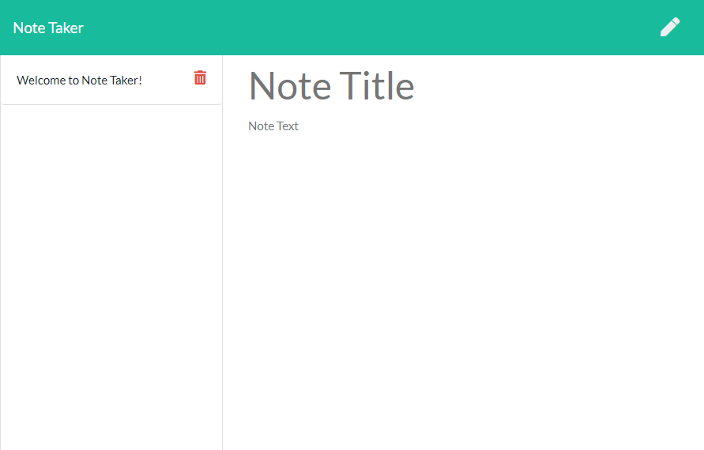
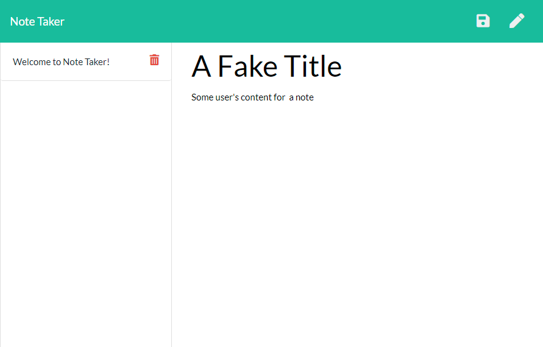
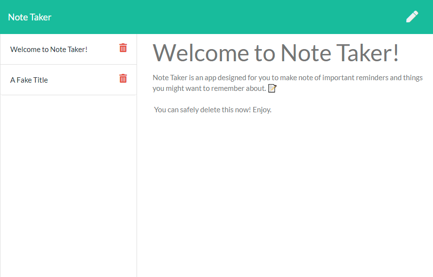

# **Note Taker**

## **Description**
***Note Taker*** is a **Node/Express** application intented for users that need to keep track of a lot of information. It is easy to forget or be unable to recall something important. Being able to take persistent notes allows users to have written information available when needed. ***Note Taker*** allows users to write and save notes, as well as to delete previously written notes.

## **Table of Contents**
* [Description](##Description)
* [Installation](##Installation)
* [Usage](##Usage)
* [License](##License)
* [Contributing](##Contributing)
* [Tests](##Tests)
* [Questions](##Questions)

## **Installation**
There is no installation process for Note Taker, the app can be found on it's deployed Website at [Note Taker.](https://scastanedamunoz-note-taker.herokuapp.com). However, all the app code is available in the [Git Hub Repository](https://github.com/SCastanedaMunoz/Note-Taker). If you decide to clone the Reposityro, you will have to open the project on your terminal and run the npm i or npm install process. This will fetch and install any required npm packages in order to run the application. ***Note Taker*** was built using Node 12.8.2 and npm 6.14.5. 

## **Usage**
As mentioned before, The main purpose of this application is for users to keep track of a lot of informatoin in a neat and centralized manner. Here are some screenshots of the different areas of the app and how they can be used:

### **Home Page**
First thing user's see when they open the app.

### **Main Page**
After clicking *Get Started*, users get taken to the main area of the app where they can write, save and see old notes.

### **User Input**
When users type out a note, they can save it on their history, so they can come back to them later.

### **Visualizing Previous Notes**
When visualizing a previous note, user's will not be able to modify the contents but they will get all of their info back.

## **License**

This project is under the MIT License:

    Copyright (c) 2020 Santiago Castaneda Munoz

    Permission is hereby granted, free of charge, to any person obtaining a copy
    of this software and associated documentation files (the "Software"), to deal
    in the Software without restriction, including without limitation the rights
    to use, copy, modify, merge, publish, distribute, sublicense, and/or sell
    copies of the Software, and to permit persons to whom the Software is
    furnished to do so, subject to the following conditions:

    The above copyright notice and this permission notice shall be included in all
    copies or substantial portions of the Software.

    THE SOFTWARE IS PROVIDED "AS IS", WITHOUT WARRANTY OF ANY KIND, EXPRESS OR
    IMPLIED, INCLUDING BUT NOT LIMITED TO THE WARRANTIES OF MERCHANTABILITY,
    FITNESS FOR A PARTICULAR PURPOSE AND NONINFRINGEMENT. IN NO EVENT SHALL THE
    AUTHORS OR COPYRIGHT HOLDERS BE LIABLE FOR ANY CLAIM, DAMAGES OR OTHER
    LIABILITY, WHETHER IN AN ACTION OF CONTRACT, TORT OR OTHERWISE, ARISING FROM,
    OUT OF OR IN CONNECTION WITH THE SOFTWARE OR THE USE OR OTHER DEALINGS IN THE
    SOFTWARE.

## **Contributing**
If you wish to contribute to the project, make sure to read the following guidelines:

* Any found bugs should be reported to the repository Issues Tab.
* If you wish your changes to be merged into the app, make sure to create well written, documented and testable code. ***Include Unit Tests***
* If you wish to add a new feature, make sure to include *user stories* as how your feature will help the app. 
* Create a pull request, after proper review it will be merged into the Git Repository

## **Tests**
As of right now, the only way to test the application is by running the node serve.js file which triggers the app environment locally. In the future, proper unit testing will be added to ensure proper Software Development practices.

## **Questions**
If you have any questions regarding this app, feel free to contact me through my email, the [README Generator Repo](https://github.com/SCastanedaMunoz/README-Generator). All questions will be answered in a reasonable amount of time.

### ***GitHub Profile***
https://github.com/SCastanedaMunoz

### ***Email Contact***
[santiagocm98@hotmail.com](mailto:santiagocm98@hotmail.com)

***