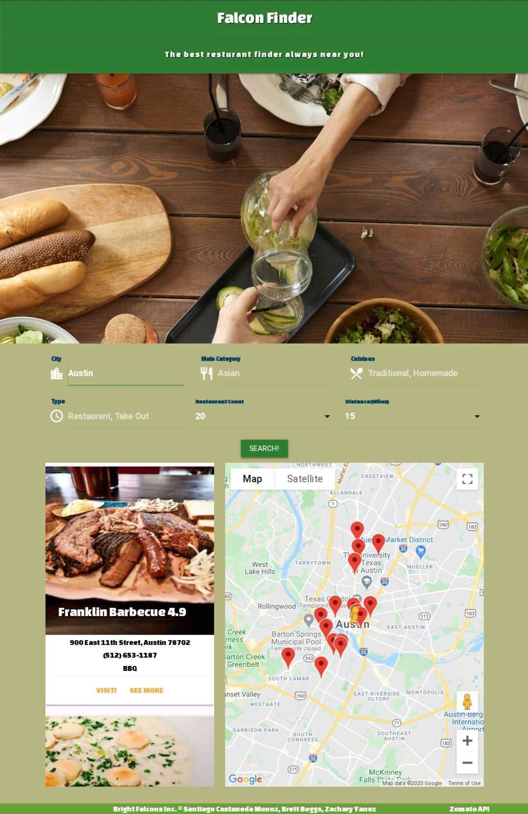
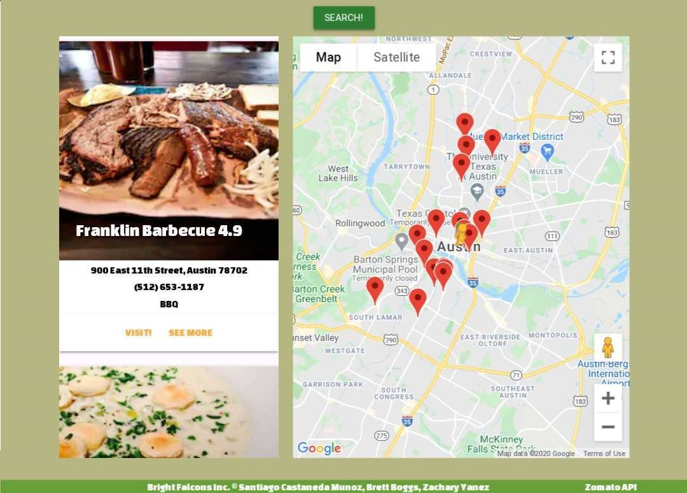

# Project-1 / Falcon Finder

## Requirements

* Must use at least two server-side APIs : ***[Google Maps](https://developers.google.com/maps/documentation/javascript/overview) and [Zomato](https://developers.zomato.com/api)***

* Must use a CSS framework _other than_ Bootstrap: ***[Materialize](https://materializecss.com/getting-started.html)***

* Must be interactive (i.e: accept and respond to user input)

* Use at least one new third-party API: ***[Google Maps](https://developers.google.com/maps/documentation/javascript/overview)***

* Must have a polished UI

* Must meet good quality coding standards

* Does not use alerts, confirms or prompts (look into _modals_)

* Must be deployed to GitHub Pages: ***[Deployed Application](https://scastanedamunoz.github.io/Project-1/)***

## ***Falcon Finder***

For this project, our initial idea to create a restaurant finder app where we could easily filter out restaurants by area and user provided information. On the beginning, we initially also planned to overlay COVID-19 infection spread information with heatmaps; however, due to development time and schedules we have decided to leave this for the future. 

Here is a quick look of the app: 

The app is currently divided into 2 sections: 

* User Input
* Search Results

### **User Input**

This section is where the user will input any important information to search their desired City about restaurants and relevant food places. Users have the choice to specify categories, cuisines, location types, etc. 

### **Search Results**

Here users will be presented with the results from their searches, they will be provided with 2 options to see the results: 

* A list of all the restaurants found with the provided parapemeters as well as some of their more important details such as address, phone number, etc.

* An interactive map where users can clearly see their provided city, as well as interact with any of the provided markers. 