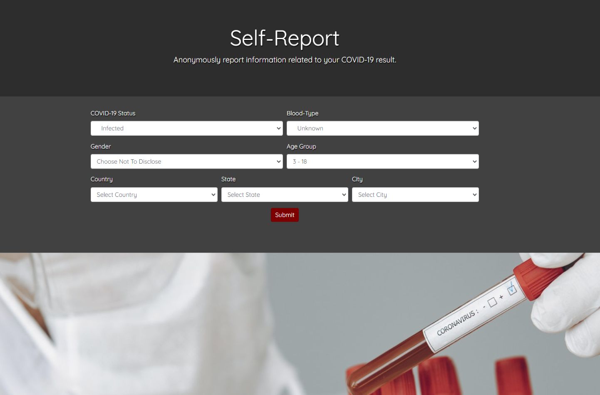
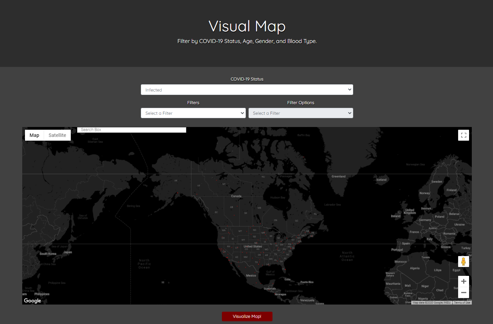

# Self-Reporting COVID-19 Application!:

## Table of Contents
- [Installation](##Installation)
- [Usage](##Usage)
- [Credits](##Credits)
- [License](##License)

## Installation
The application is web-based. Click the following link to see it in action: https://tuxedoed-turtles-project-2.herokuapp.com

Link to Repository: https://github.com/SCastanedaMunoz/Project-2

## Usage
The application is divided into two sections:
1. ### Self-Reporting Form:
    The user can report themselves as "infected", "previously infected", or "not infected", as well as entering their personal information, including blood type, age group (3-18, 19-29, 30-39, etc.), gender, and location.
    

2. ### COVID-19 Map:
    The user can navigate to the ‘Map’ page which displays a google map (utilizing the Google Maps API) with all the compiled data from our database to show the user how many positive cases of COVID-19 have been reported in any given city around the world. The user can also select from a series of filters to display the number of cases based on case status, gender, age, and blood type. Make sure to select the 'Visualize' button below the map to render the data.
    

## Credits
    Designed/Coded by Tuxedoed Turtles:
    • Brett Boggs: @BreadBooks
    • Santiago Castaneda Munoz: @SCastanedaMunoz
    • Emmanuel Durand: @manu-austin
    • Marshall Lowry: @MJL1993

    Google Maps API: developer.google.com/maps
    Location Generator: https://geodata.solutions/ 

## Photo Credit
Pexel Credits: [Welcome](https://www.pexels.com/photo/crop-man-putting-medical-mask-on-face-of-ethnic-child-4546132/), [Visualize](https://www.pexels.com/photo/global-coronavirus-map-with-country-statistics-4021262/), [Report](https://www.pexels.com/photo/chart-close-up-data-desk-590022/), and [ReportApp](https://www.pexels.com/photo/crop-scientist-holding-test-tube-with-positive-coronavirus-result-4149047/)
 
## License

MIT License

Copyright (c) 2020 Santiago Castaneda Munoz

Permission is hereby granted, free of charge, to any person obtaining a copy
of this software and associated documentation files (the "Software"), to deal
in the Software without restriction, including without limitation the rights
to use, copy, modify, merge, publish, distribute, sublicense, and/or sell
copies of the Software, and to permit persons to whom the Software is
furnished to do so, subject to the following conditions:

The above copyright notice and this permission notice shall be included in all
copies or substantial portions of the Software.

THE SOFTWARE IS PROVIDED "AS IS", WITHOUT WARRANTY OF ANY KIND, EXPRESS OR
IMPLIED, INCLUDING BUT NOT LIMITED TO THE WARRANTIES OF MERCHANTABILITY,
FITNESS FOR A PARTICULAR PURPOSE AND NONINFRINGEMENT. IN NO EVENT SHALL THE
AUTHORS OR COPYRIGHT HOLDERS BE LIABLE FOR ANY CLAIM, DAMAGES OR OTHER
LIABILITY, WHETHER IN AN ACTION OF CONTRACT, TORT OR OTHERWISE, ARISING FROM,
OUT OF OR IN CONNECTION WITH THE SOFTWARE OR THE USE OR OTHER DEALINGS IN THE
SOFTWARE.
