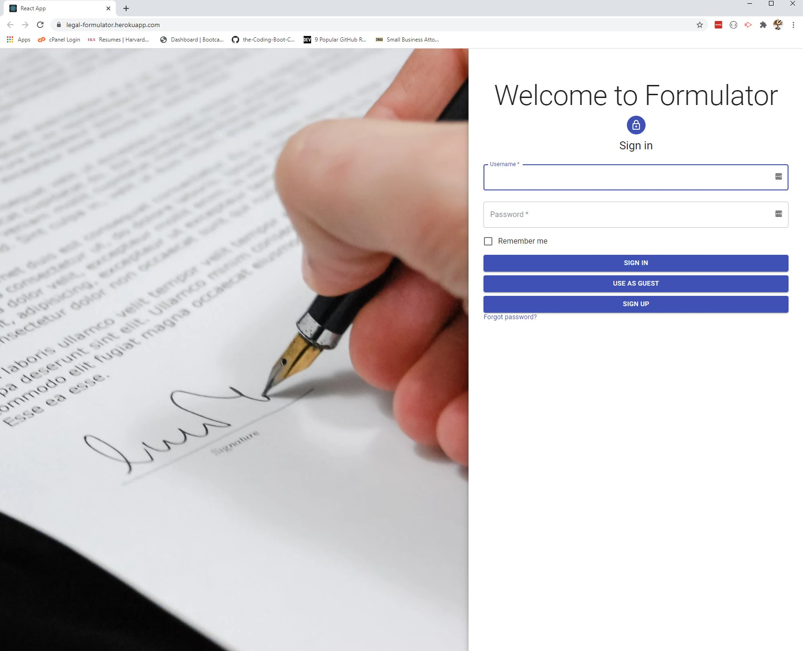
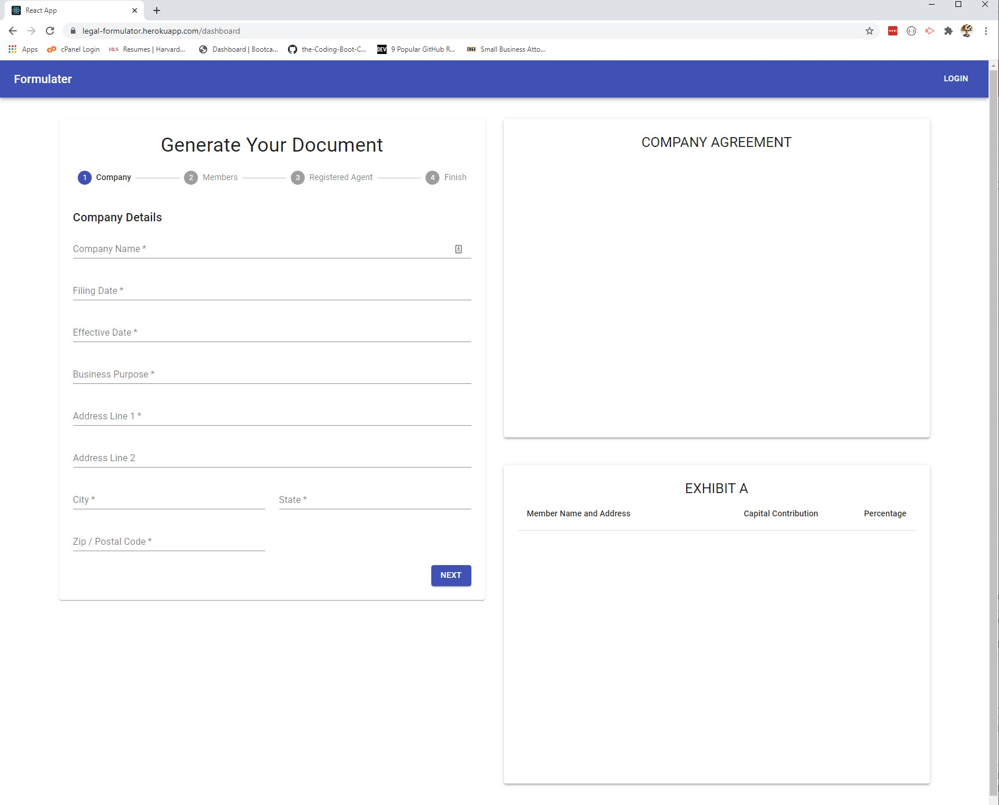

# 📝 Formulator

[Deployed Application Link](https://legal-formulator.herokuapp.com/)

Formulator is a React application that allows users to create legal docuements quick and effeciently by using pre-generated documennts. Users simply fill out the a form based on the document selected, rendering the document as it is filled out. Once finished, anyone may download the document using docx, but registered users currently logged in may then save their document for future access. Users can then access or delete documents. 

# Inner-Workings of the Website

This website was created by ultizing the following technologies: 
* React
* Material-UI
* docx
* Passport + Bcrypt.js
* Express
* MongoDB & Mongoose
* file-saver
* And more!

# Team
* [Brett](https://github.com/BreadBooks) - UI Design, Front-End
* [James](https://github.com/jth2698) - Form Database, Form Generation, Back-End 
* [Santiago](https://github.com/SCastanedaMunoz) - Docx, Back-End, Testing & Debugging 
* [Chris](https://github.com/cldominy) - User Authoization, Front-End

# Future Developments
The following are ideas for future changes for the website: 
* Adding more templates for users to select from
* Creating user profiles 
* Sharing documents between users
* DocuSign integration 
