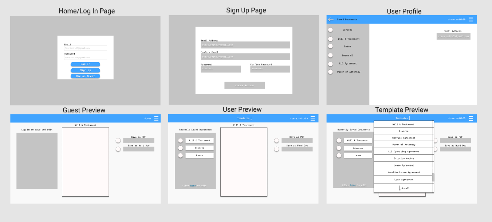

# The Fighting Artichokes

## Project 3, Deliverable 1

### An overview of the intended application and why you feel it's valuable.

This application will allow users to dynamically generate complex legal documents based on simple, easy-to-answer questions. The application will allow users to see their documents being built in real-time as questions are answered and will allow users to download their documents in multiple formats or to save and store for future use.

We believe that this application will provide significant value to users who have a need to generate well-drafted and cleanly-formatted legal documents but who cannot or do not want to retain a lawyer for document preparation. Specific value propositions are - 

* The application's use of thoroughly-vetted templates as the base for generated documents.
* The ability to generate custom legal documents based on those templates without the need for legal drafting.
* The provision of generated documents in multiple formats (formatted HTML, docx, pdf, etc.) and the ability to integrate with needed third party services such as DocuSign.
* Authentication and hosted storage capacity, so that users can view previously-generated documents and access all generated documents at any time in one centralized location.

### A set of detailed screen-by-screen design layouts with annotations describing all UI/UX components and all data relevant to the screen.

### A breakdown of roles by group member.

* Brett => Design, wireframe, layout
* James => Initial document templates, user questions / content, database
* Santiago => Web document templates, also database
* Chris => Design & React components, catch-all

### A schedule for completion of various tasks.

### A screenshot of your Project Management Board that shows breakdown of tasks, assigned to group members with a schedule.
