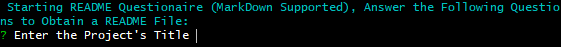

# **README Generator**

## **Description**
***README Generator*** is a **CLI** application intention is to create baseline **README** files for software projects. The main purpose of this CLI application is to cut the time developers spend writing **README** files and allow them to use more of their time actually developing their apps!

## **Table of Contents**
* [Description](##Description)
* [Installation](##Installation)
* [Usage](##Usage)
* [License](##License)
* [Contributing](##Contributing)
* [Tests](##Tests)
* [Questions](##Questions)

## **Installation**
As of right now, the process to install ***README Generator*** is by downloading the Git Repository from the following GitHub Link: [README Generator Repo](https://github.com/SCastanedaMunoz/README-Generator), after doing so, you will have to open the project on your terminal and run the *npm i* or *npm install* commmand. This will fetch and install any required npm packages in order to run the application. Since this CLI application was built utilizing **Node.js** and **npm**, you will need to have such dev dependencies already installed in your project. ***README Generator*** was built using **Node 12.8.2** and **npm 6.14.5**. In the future, this app will be distributed via npm for a more easy download and usage.

## **Usage**
As mentioned before, the main purpose of this CLI application is to cut the time developers spend writing **README** files and allow them to use more of their time actually developing their apps. Although, a lot of can be achieved by using this **CLI Application**, this is purely meant to create a well structured base for your **README** files, there is always room for improvement so do not take any outputs as a final version! Make your **README** files richer and better!

Here is a Video Walkthrough on how to use the app: [Video Walkthrough.](https://drive.google.com/file/d/1M4yuWK0EnRpK7FxjzW89TGU2qR9TFmu3/view?usp=sharing)

## **License**

This project is under the ISC License:

    Copyright (C) 2020 Santiago Castaneda Munoz
    
    Permission to use, copy, modify, and/or distribute this software for any purpose with
    or without fee is hereby granted, provided that the above copyright notice and this
    permission notice appear in all copies.
    
    THE SOFTWARE IS PROVIDED "AS IS" AND THE AUTHOR DISCLAIMS ALL WARRANTIES WITH REGARD
    TO THIS SOFTWARE INCLUDING ALL IMPLIED WARRANTIES OF MERCHANTABILITY AND FITNESS. IN 
    NO EVENT SHALL THE AUTHOR BE LIABLE FOR ANY SPECIAL, DIRECT, INDIRECT, OR
    CONSEQUENTIAL DAMAGES OR ANY DAMAGES WHATSOEVER RESULTING FROM LOSS OF USE, DATA
    OR PROFITS, WHETHER IN AN ACTION OF CONTRACT, NEGLIGENCE OR OTHER TORTIOUS ACTION,
    ARISING OUT OF OR IN CONNECTION WITH THE USE OR PERFORMANCE OF THIS SOFTWARE.

## **Contributing**
If you wish to contribute to the project, make sure to read the following guidelines:

* Any found bugs should be reported to the repository Issues Tab.
* If you wish your changes to be merged into the app, make sure to create well written, documented and testable code. ***Include Unit Tests***
* If you wish to add a new feature, make sure to include *user stories* as how your feature will help the app. 
* Create a pull request, after proper review it will be merged into the Git Repository

## **Tests**
As of now, the only way to test the application is by running the node index.js file which triggers the app main functionality. In the future, proper unit testing will be added to ensure proper Software Development practices.

See the following test instructions in order to test the app: 

1. Select the App Folder.

    
2. Call *node index.js** to start the app.

    
3. Start answering the questionarie to obtain your **README** file.

    

## **Questions**
If you have any questions regarding this app, feel free to contact me through my email, the [README Generator Repo](https://github.com/SCastanedaMunoz/README-Generator). All questions will be answered in a reasonable amount of time.

### ***GitHub Profile***
https://github.com/SCastanedaMunoz

### ***Email Contact***
[santiagocm98@hotmail.com](mailto:santiagocm98@hotmail.com)

***

**THIS README FILE WAS CREATED UTILIZING THE README GENERATOR CLI APP**
