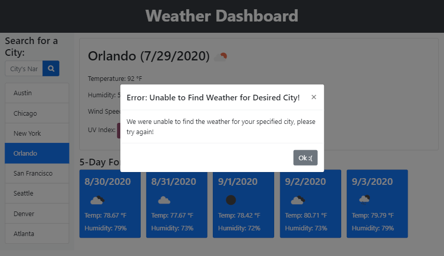
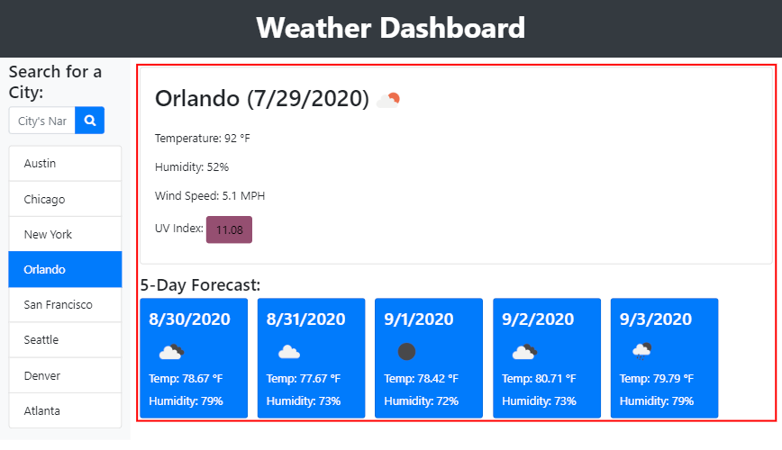

# Weather-Dashboard

## Project Development

For this project, I took the approach of building in HTML the standard elements neeeded to build a weather dashboard. As such, I used JavaScript and JQuery to dinamically fill up the required elements to build the dashboard.

Here is a look at the finished Application: 


The dashboard also includes a historic list of recent searched cities, so the user can easily access such cities without having to rewrite the city name.

The dashboard history is outline as follows: 


Any element inside of the list completely clickable. Additionally, if the API is unable to find weather for a specific city, a modal will appear and let the user know about this: 



The dashboard also includes current weather data for the selected city and a forecast for the 12:00PM for the next 5 days. As seen in the following screenshot: 



## Goals

### User Story

```
AS A traveler
I WANT to see the weather outlook for multiple cities
SO THAT I can plan a trip accordingly
```

### Acceptance Criteria

```
GIVEN a weather dashboard with form inputs
WHEN I search for a city
THEN I am presented with current and future conditions for that city and that city is added to the search history
WHEN I view current weather conditions for that city
THEN I am presented with the city name, the date, an icon representation of weather conditions, the temperature, the humidity, the wind speed, and the UV index
WHEN I view the UV index
THEN I am presented with a color that indicates whether the conditions are favorable, moderate, or severe
WHEN I view future weather conditions for that city
THEN I am presented with a 5-day forecast that displays the date, an icon representation of weather conditions, the temperature, and the humidity
WHEN I click on a city in the search history
THEN I am again presented with current and future conditions for that city
WHEN I open the weather dashboard
THEN I am presented with the last searched city forecast
```