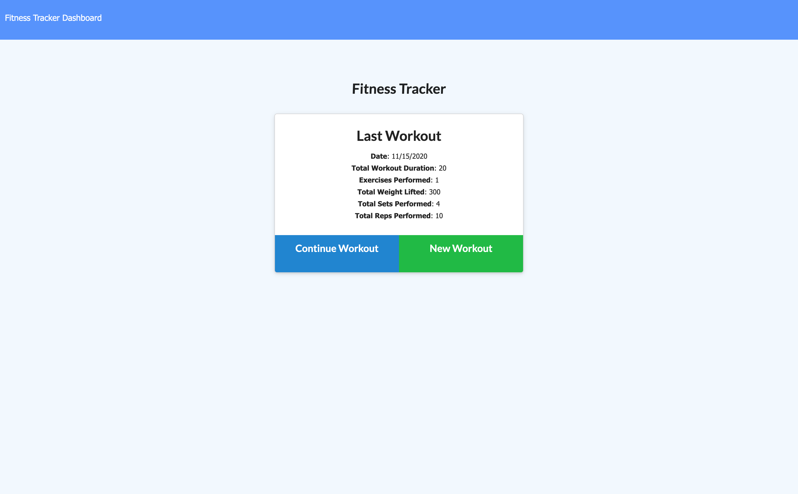
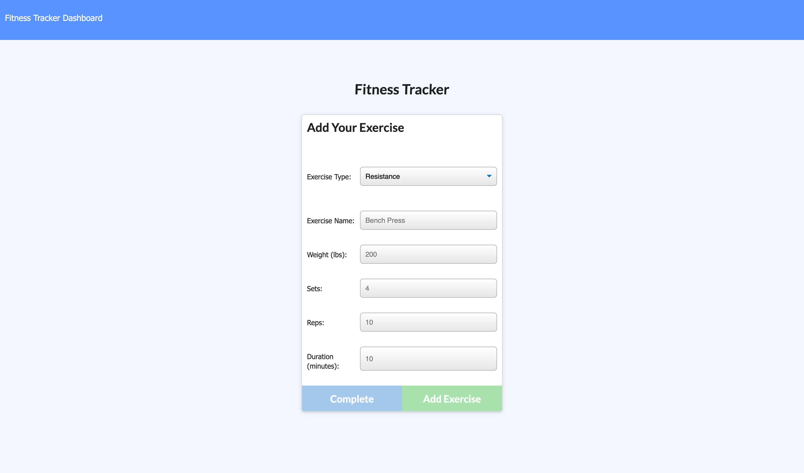
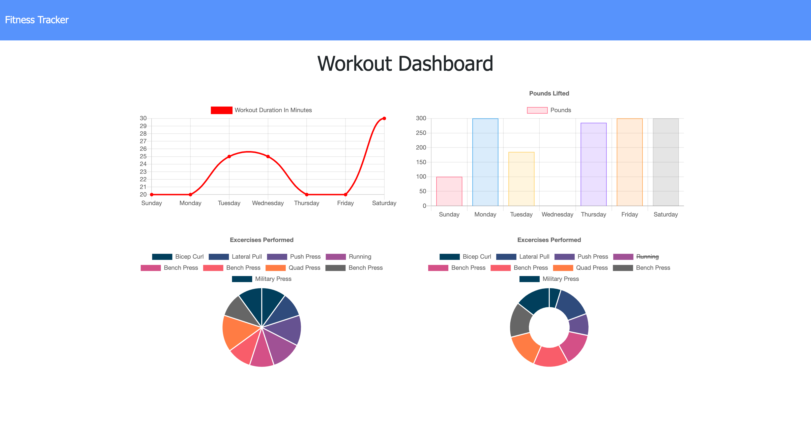

# **Note Taker**

## **Description**
***Workout Tracker*** is a **Node**, **Express**, **Mongoose**, **MongoDB**, and **Heroku**, application intented for users that want to keep track of their workout routine, as well as getting a detail visual breakdown of their routines, duration and repetitiveness. It is easy to forget or be unable to recall the type of workouts and routines being followed during a week of exercise, ***Workout Tracker*** allows users to analyze and properly visualize this information as they continue with their schedule. Being able to take persistent notes of Burgers to devour allows users to have this written information available when needed.

## **Table of Contents**
* [Description](##Description)
* [Installation](##Installation)
* [Usage](##Usage)
* [License](##License)
* [Contributing](##Contributing)
* [Questions](##Questions)

## **Installation**
There is no installation process for ***Workout Tracker***, the app can be found on it's deployed Website at [Workout Tracker.](scastanedam-workout-tracker.herokuapp.com). However, all the app code is available in the [Git Hub Repository](https://github.com/SCastanedaMunoz/Workout-Tracker). If you decide to clone the Repository, you will have to open the project on your terminal and run the npm i or npm install process. This will fetch and install any required npm packages in order to run the application. ***Workout Tracker*** was built using Node 12.8.2 and npm 6.14.5. 

## **Usage**
As mentioned before, The main purpose of this application is for users to keep track of their workout routine, as well as getting a detail visual breakdown of their routines, duration and repetitiveness. Here are some screenshots of the different areas of the app and how they can be used:

### **Home Page**
First thing user's see when they open the app. Information about the last workout is displayed.

### **Exercise Records**
Users can use this form to add additional exercises to a workout.

### **Visualization**
Users can utilize the dashboard to visualize their workout routines across the week.

## **License**

This project is under the MIT License:

    Copyright (c) 2020 Santiago Castaneda Munoz

    Permission is hereby granted, free of charge, to any person obtaining a copy
    of this software and associated documentation files (the "Software"), to deal
    in the Software without restriction, including without limitation the rights
    to use, copy, modify, merge, publish, distribute, sublicense, and/or sell
    copies of the Software, and to permit persons to whom the Software is
    furnished to do so, subject to the following conditions:

    The above copyright notice and this permission notice shall be included in all
    copies or substantial portions of the Software.

    THE SOFTWARE IS PROVIDED "AS IS", WITHOUT WARRANTY OF ANY KIND, EXPRESS OR
    IMPLIED, INCLUDING BUT NOT LIMITED TO THE WARRANTIES OF MERCHANTABILITY,
    FITNESS FOR A PARTICULAR PURPOSE AND NONINFRINGEMENT. IN NO EVENT SHALL THE
    AUTHORS OR COPYRIGHT HOLDERS BE LIABLE FOR ANY CLAIM, DAMAGES OR OTHER
    LIABILITY, WHETHER IN AN ACTION OF CONTRACT, TORT OR OTHERWISE, ARISING FROM,
    OUT OF OR IN CONNECTION WITH THE SOFTWARE OR THE USE OR OTHER DEALINGS IN THE
    SOFTWARE.

## **Contributing**
If you wish to contribute to the project, make sure to read the following guidelines:

* Any found bugs should be reported to the repository Issues Tab.
* If you wish your changes to be merged into the app, make sure to create well written, documented and testable code. ***Include Unit Tests***
* If you wish to add a new feature, make sure to include *user stories* as how your feature will help the app. 
* Create a pull request, after proper review it will be merged into the Git Repository

## **Questions**
If you have any questions regarding this app, feel free to contact me through my email, or the [Git Hub Repository](https://github.com/SCastanedaMunoz/Workout-Tracker). All questions will be answered in a reasonable amount of time.

### ***GitHub Profile***
https://github.com/SCastanedaMunoz

### ***Email Contact***
[santiagocm98@hotmail.com](mailto:santiagocm98@hotmail.com)